> **备注：** 本篇文章主要受众是中国大陆的 AI 软件订阅用户，尤其是那些没有海外银行发行的信用卡的用户。但其他国家同样适用。

直接说核心结论：如果你没有海外银行发行的信用卡，那么当前 **App Store 应用内购订阅** 是你能获得最稳定的各大海外 AI 厂商订阅套餐的方式了。

## 背景

在推特上看到 [Passluo](https://x.com/passluo) 说到 AI 中转站审计那篇论文，主要内容是其实国内大多数的 AI 服务中转站，并不是向用户提供的官方满血 API 服务，甚至都不是同一个模型。其实这一点，我们作为用户，当看到中转站 API 服务价格远低于官方的时候，心里应该也有数了，价格本身就说明了问题。

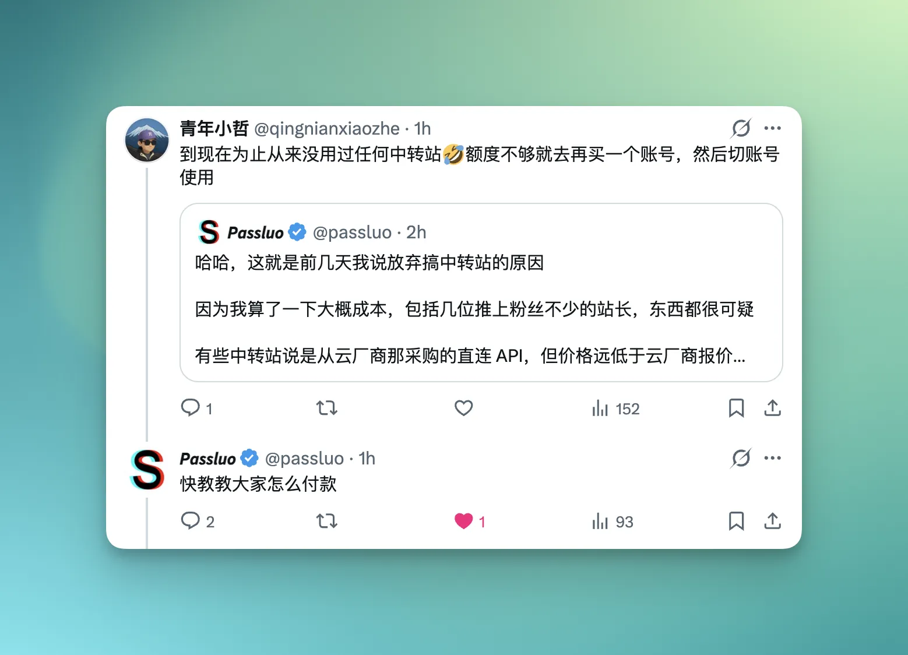

## 我的订阅

从 2023 年开始重度使用 ChatGPT 开始，我没有使用过任何中转站。到现在为止，我订阅过：

- **ChatGPT Plus 会员** — 账号从 2023 注册，截至目前持续使用，没有被封号
- **Claude Pro 账号 1** — 从 2024 年中开始订阅，截至目前稳定使用超过一年
- **Claude Pro 账号 2** — 第一个账号额度不够用，又买不起 Max 订阅，增加账号当作 2x 使用
- **GitHub Copilot Pro** — 从 2024 年开始订阅，断断续续持续续订

有了上面的这些订阅，再加上 Google AI Pro，我现在已经有了用不完的 Claude Opus 4.6 模型使用量。再加上偶尔使用 Codex，现在真的是用不完，根本用不完。

下面两个截图是我的 App Store 订阅截图。可以看到除了 AI 服务之外，还有 iCloud+ 和 YouTube 这种基础服务。

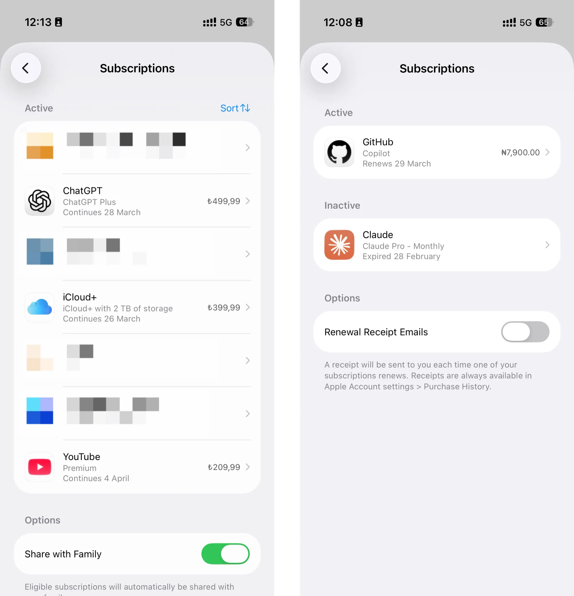

你会看到，上面的 App Store 订阅是有两个截图的。这是因为这两个本来就是完全不同的 App Store 区域的账号。

接下来我来详细介绍一下整个实现的过程。**上面这些我能做到的，对你来说，完全都可以实现，没有任何卡点。**

## 地区选择

从头开始第一步就是去注册对应区域的 App Store 账号了。例如我现在想购买 ChatGPT 的订阅，但 App Store 账号区分全球那么多的国家和地区，到底在哪个国家地区的价格最便宜？

以 ChatGPT 为例，选择 ChatGPT Plus 会员月付选项。从网站上可以看到，原价 $20 美元的价格，在土耳其的 App Store 只需要 **¥78 块钱**。那接下来我们就知道要去搞一个土耳其的 App Store 账号了。

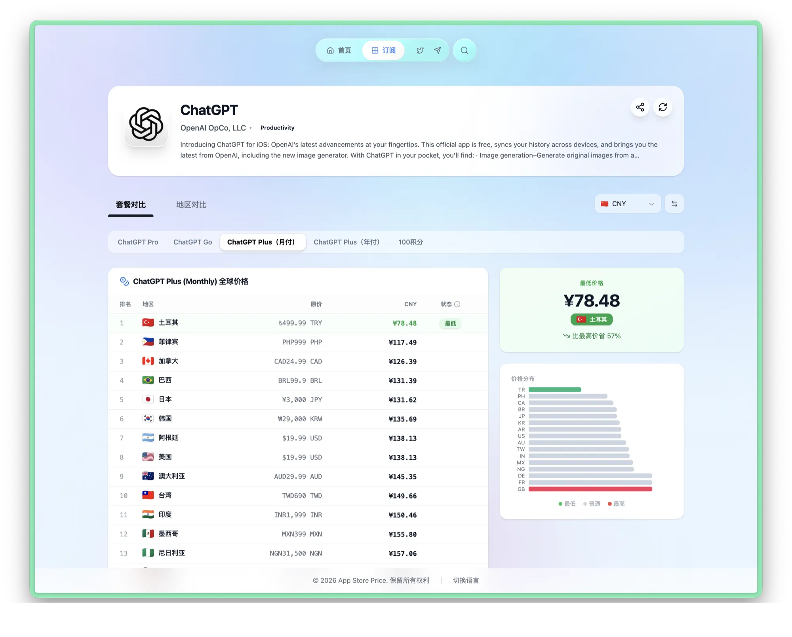

## Apple ID 注册

准备工作：

- 一台 iOS 设备（iPad 或 iPhone）
- 一个土耳其节点
- 一个邮箱，接收验证码
- 一个中国手机号

### 1. 验证节点

切换到土耳其节点之后，先打开 IP 地址验证网站验证一下。推荐 [ip.skk.moe](https://ip.skk.moe)，内容非常清晰简洁。

如果你的机场没有土耳其节点，也可以选择其他有节点的低价区来注册。

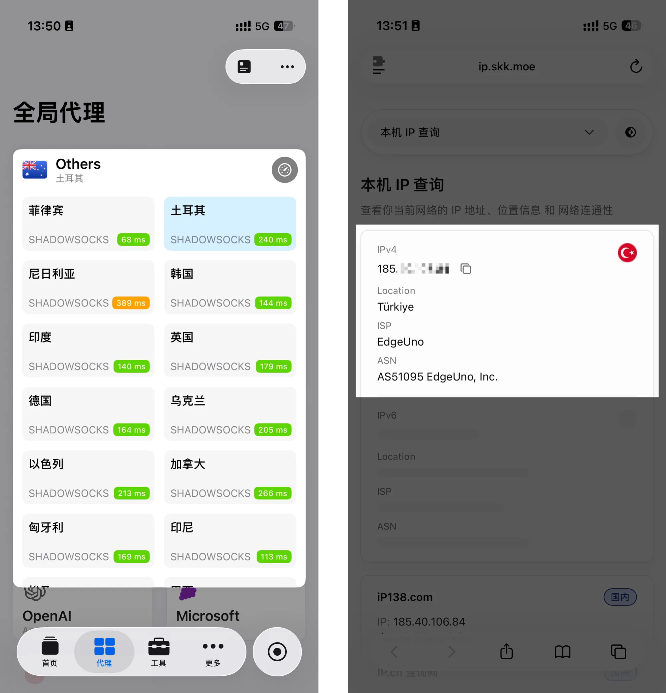

### 2. 注册账号

打开 [account.apple.com](https://account.apple.com) 开启注册流程。

> **提示：** 苹果 Apple ID 的网址更改了，之前是 appleid.apple.com，目前两者都可以使用。

基本上只要保证要注册的 Apple ID 账号区域和 VPN 代理节点一致，基本都能成功。

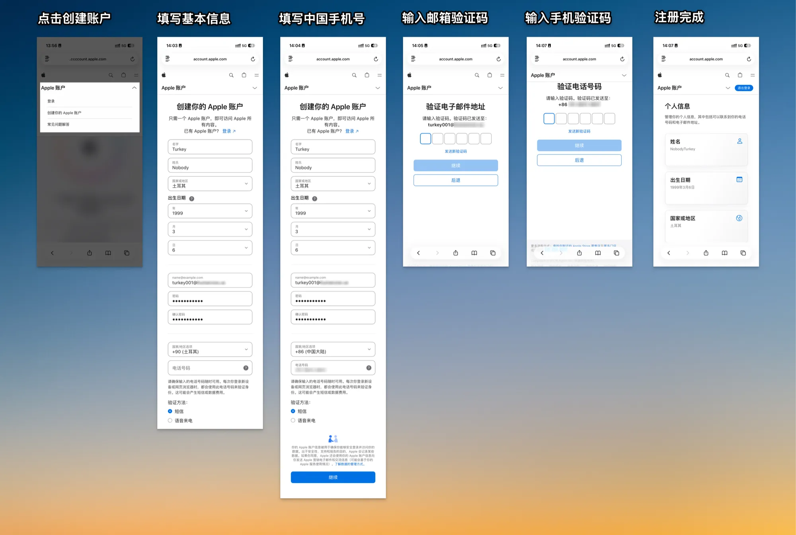

到这一步 Apple ID 的注册就完成了，可以在 iPhone App Store 登录了。

### 3. 填写 Payment Address

登录之后，最好去填写一下 Payment Address。虽然没有任何的土耳其支付方式，但仍然需要填写地址信息，否则购买时 Apple 还是会要求输入。

可以从 Google Maps 中随便找一个土耳其的地址。不需要非常详细，只写城市、街道、邮编。手机号直接填注册时使用的中国手机号即可，不需要输入 +86，直接输入 1xx 即可，也不需要接收验证码。

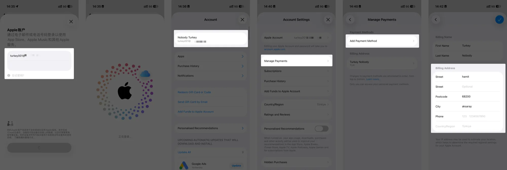

## Apple 充值

准备工作完成，接下来向 Apple ID 内进行充值。

基本上任意国家的礼品卡，都可以从淘宝、闲鱼等渠道直接找到。对于**尼日利亚区**和**土耳其区**：

- **尼日利亚区**的礼品卡，目前只能从闲鱼渠道购买。暂未发现其他靠谱的方式。
- **土耳其区**的礼品卡，淘宝和闲鱼都可以买到，也可以从土耳其的购物平台直接买（需要一张国内银行发行的 Visa/MasterCard）。

> 这里不对商家进行推荐，可在闲鱼中搜索「尼日利亚礼品卡」按销量排名 + 价格最低原则购买即可。

闲鱼的购买方式就不详细说了，买完之后都会自动发送礼品卡信息，直接兑换即可。但对于土耳其区，可以自己从购物平台购买，推荐有 Visa/MasterCard 的人直接线上购买。

这里推荐 **oyunfor.com** 这个网站：Turkiye's Most Popular Website for Game Epin Sales and Digital Code Shopping.

网站默认是土耳其语，打开后可以使用 Google 翻译把页面翻译为中文或英文。

**第 1 步：打开购物平台**

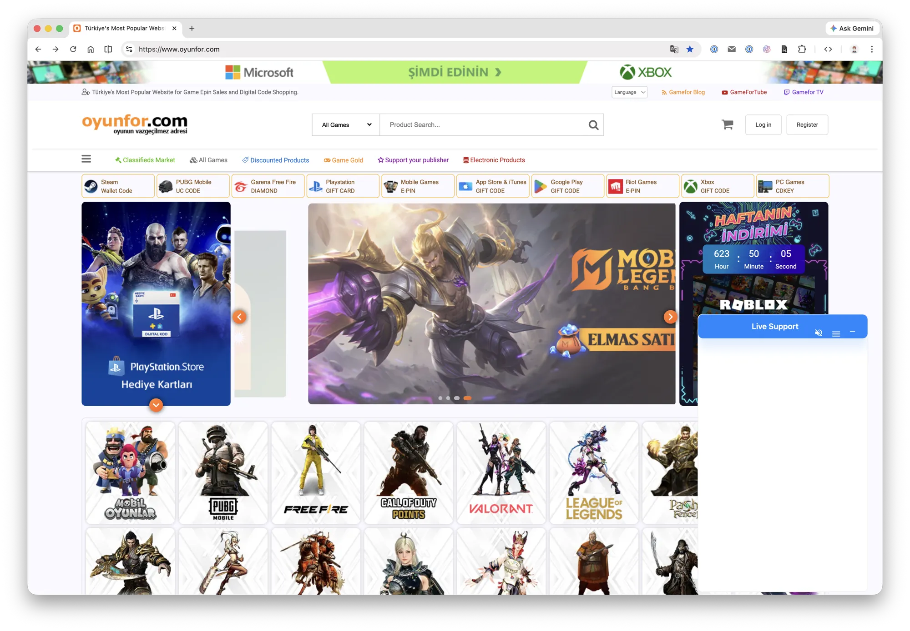

**第 2 步：点击右上角注册，注册后登录账户**

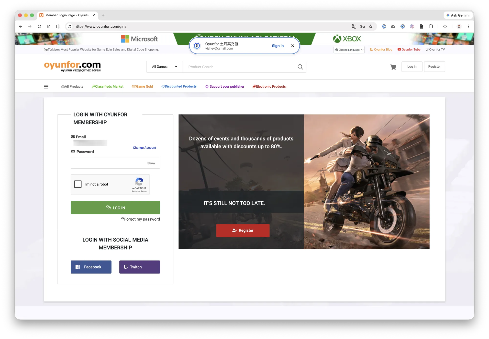

**第 3 步：登录之后，右上角有你的用户名称**

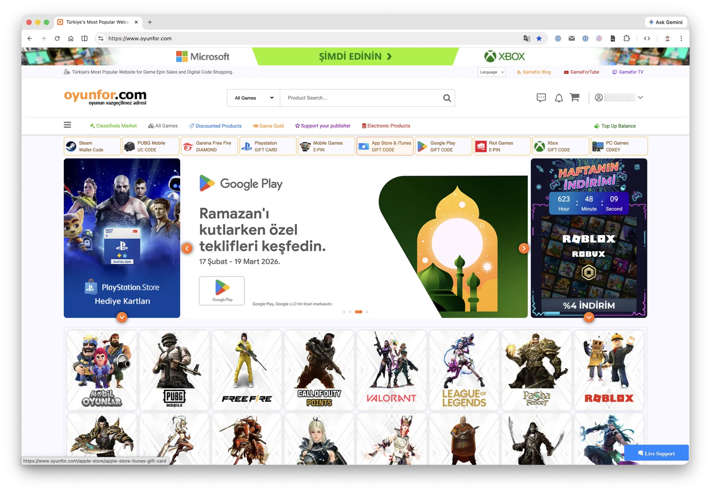

**第 4 步：点击屏幕上方中间的 App Store 礼品卡，选择想购买的面值**

如果没有推荐位，也可以直接搜索。选好面值后点击添加到购物车，就直接到支付页面了。

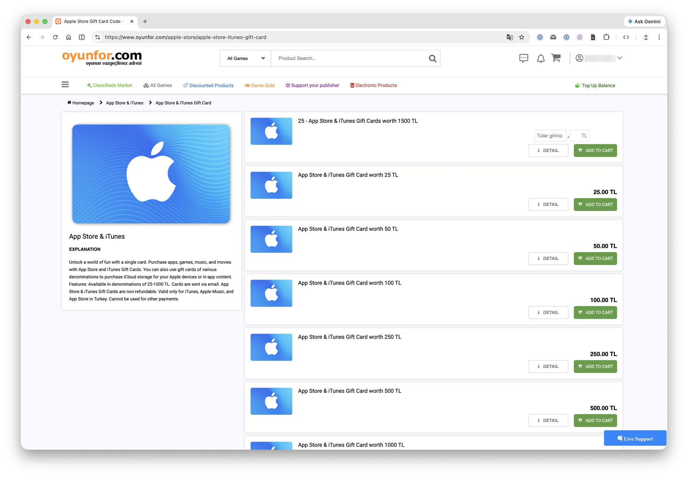

**第 5 步：选择支付方式**

这里购买的是 1000 TL 土耳其里拉。平台支持信用卡和币安 Pay 支付。信用卡支付时，右侧有三个选项，第一个需要土耳其本地支付，所以选择后面两个。最后一个手续费低，推荐使用。

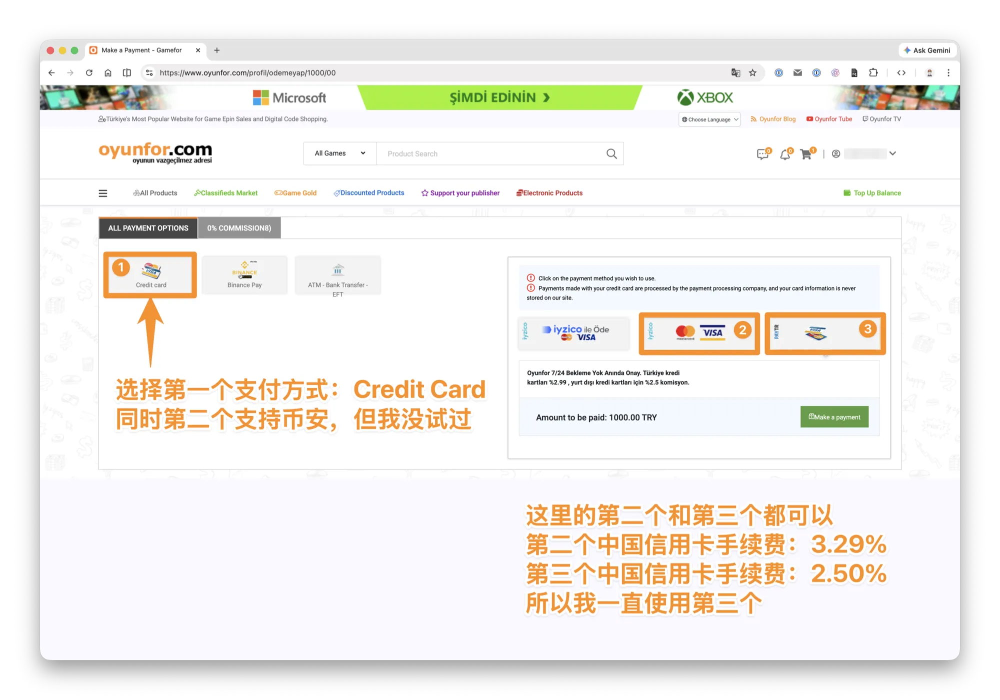

**第 6 步：输入支付信息**

1000 里拉 + 2.5% 的手续费就是需要支付的总额。第一次使用输入信用卡卡号、有效期即可。

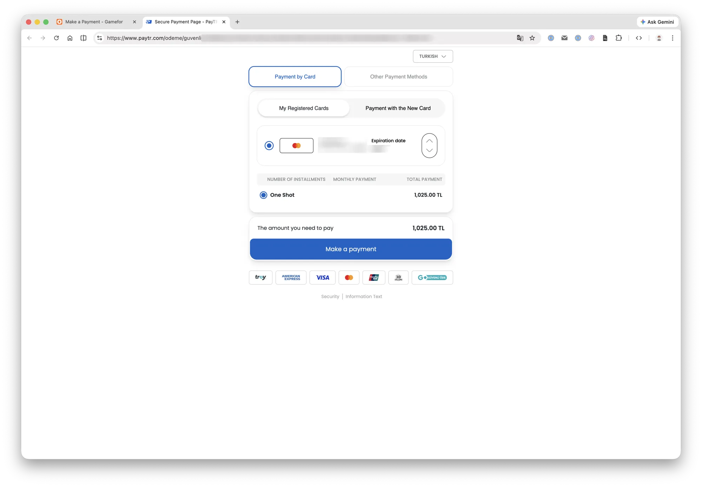

**第 7 步：完成支付**

点击继续支付，接收银行验证码，即可完成支付。

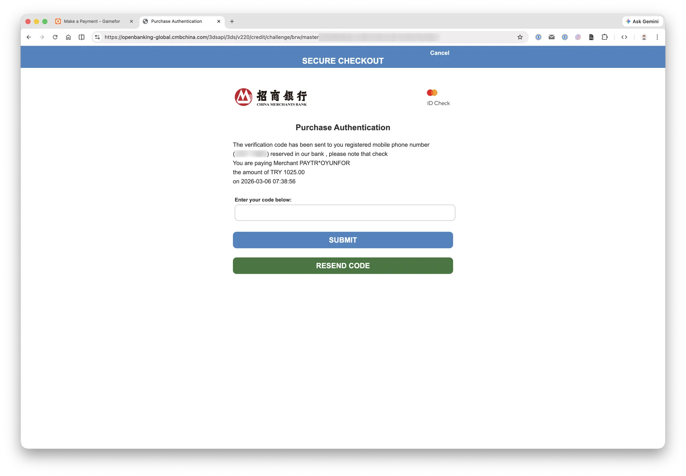

**第 8 步：收取礼品卡**

完成支付后，基本几分钟内就可以收到 Oyunfor 的邮件，内含礼品卡兑换 ID。购买多个则邮件里有多个 ID，不会拆分多封。

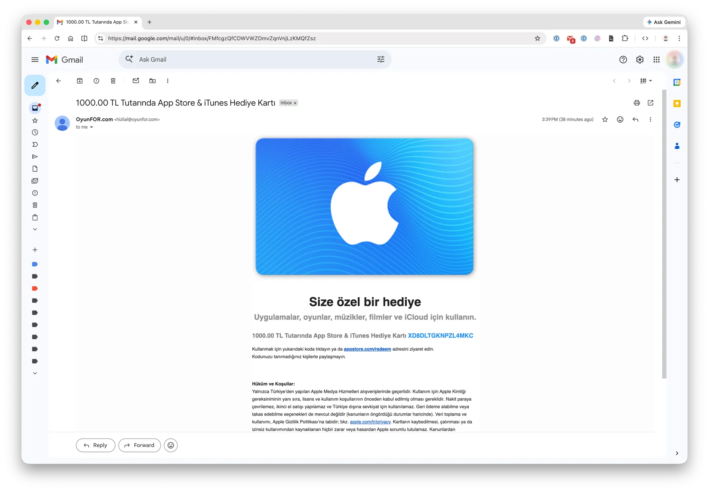

最后，把邮箱收到的礼品卡兑换码在应用商店内兑换一下就完成了。

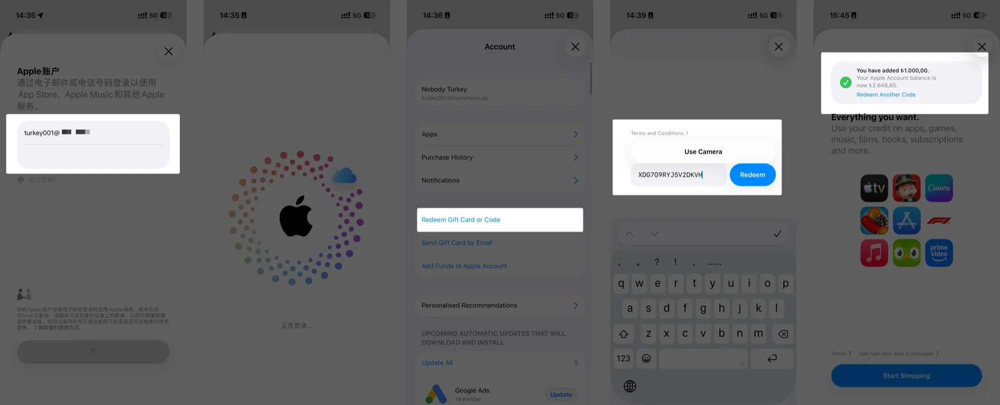

## 购买订阅

以购买 ChatGPT Plus 会员为例：先在应用商店登录土耳其 Apple ID，用这个 ID 下载 ChatGPT（如果之前用美区或其他区 ID 下载过，需要先删除再重新下载）。

下载完成后打开 ChatGPT，登录你的账号，选择对应的订阅直接购买即可。后续如果开了自动续费，保证 Apple ID 余额充足即可。也不会遇到 ChatGPT 或 Claude 封号的情况。

> 这样，你就有了一个正规付费之后的 ChatGPT Plus 会员账号了。**没有灰产、没有黑卡，全部来自在线的正规渠道。**

如果你想购买的是 Claude Code 的 Pro 或者 Max 订阅，同样，打开网站找到 Claude 看看哪个区域最便宜。

对于 Claude 来说，**尼日利亚的价格就相当有优势了**：

| 套餐 | 价格 |
|------|------|
| Pro 月付 | ¥74 |
| Max 5x | ¥498 |
| Max 20x | ¥997 |

可以确定的是，这 100% 是官方的原始版本模型，没有任何替换，没有任何缩水。

同时分享我的实际操作：我的两个 Claude Pro 账号都是在尼日利亚区注册的 Apple ID 购买的。第一个账号额度消耗完成后，只需在 Claude App 里切换账号，再次通过应用内购购买即可——相当于花两份钱，使用 2x 额度。算下来，通过这种形式得到的 5x 竟然比直接购买 5x 套餐还要便宜一些。

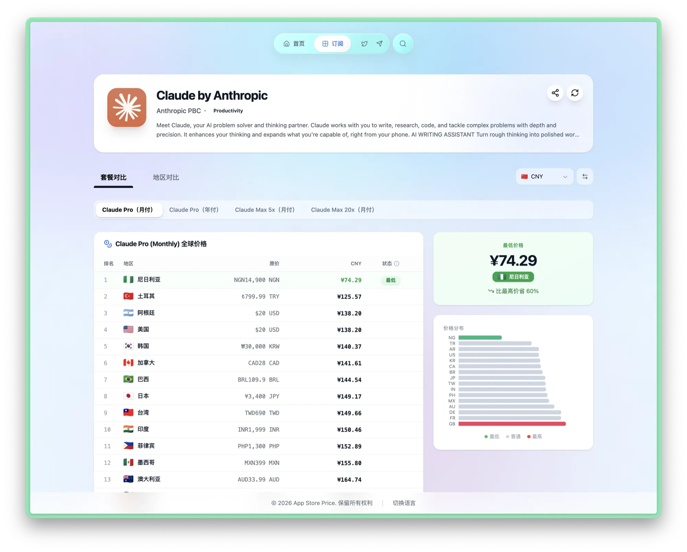

## 最后

至此，关于如何获得稳定、可靠的 ChatGPT 和 Claude 订阅的介绍就全部结束了。总结下来，唯一比较难的是土耳其/尼日利亚/菲律宾这种 VPN 节点的获取，如果你现在使用的机场已经有了这些节点，那直接使用就好。

后续，我会继续在 GitHub 上给大家分享一些 AI 订阅和 AI 使用的基础教程，包括：

- ChatGPT / Claude 账号注册指南（区域限制的解决方法）
- 更多低价区的礼品卡购买渠道汇总与对比
- 常见问题解答：账号安全、自动续费、封号预防
- AI 工具的日常高效使用技巧（提示词、工作流等）

如果你觉得本文有帮助，欢迎到 GitHub 项目主页 Star 收藏。

<a href="https://appstoreprice.net/zh/apps" target="_blank" rel="noopener noreferrer" style="display: block; position: relative; overflow: hidden; border-radius: 1rem; background: linear-gradient(135deg, #2563eb, #3b82f6, #06b6d4); padding: 1.25rem 1.5rem; color: white; text-decoration: none; box-shadow: 0 10px 25px -5px rgba(37, 99, 235, 0.15); transition: transform 0.3s, box-shadow 0.3s;" onmouseover="this.style.transform='scale(1.02)';this.style.boxShadow='0 20px 40px -5px rgba(37,99,235,0.3)'" onmouseout="this.style.transform='scale(1)';this.style.boxShadow='0 10px 25px -5px rgba(37,99,235,0.15)'">

<strong style="font-size: 1.125rem;">查看你想订阅的 App 价格</strong>
在 App Store Price 上查找 ChatGPT、Claude 等热门应用在全球各地区的价格

</a>

<a href="https://github.com/ennann/apple-id-subscribe-ai" target="_blank" rel="noopener noreferrer" style="display: block; position: relative; overflow: hidden; border-radius: 1rem; background: linear-gradient(135deg, #1f2937, #111827, #000); padding: 1.25rem 1.5rem; color: white; text-decoration: none; box-shadow: 0 10px 25px -5px rgba(0, 0, 0, 0.15); transition: transform 0.3s, box-shadow 0.3s;" onmouseover="this.style.transform='scale(1.02)';this.style.boxShadow='0 20px 40px -5px rgba(0,0,0,0.3)'" onmouseout="this.style.transform='scale(1)';this.style.boxShadow='0 10px 25px -5px rgba(0,0,0,0.15)'">

<strong style="font-size: 1.125rem;">觉得有帮助？给个 Star 吧</strong>
后续更新更多 Apple ID 相关教程，Star 收藏不迷路

</a>

<a href="https://api-flowercloud.com/aff.php?aff=5358" target="_blank" rel="noopener noreferrer" style="display: block; position: relative; overflow: hidden; border-radius: 1rem; background: linear-gradient(135deg, #f59e0b, #f97316, #eab308); padding: 1.25rem 1.5rem; color: white; text-decoration: none; box-shadow: 0 10px 25px -5px rgba(245, 158, 11, 0.15); transition: transform 0.3s, box-shadow 0.3s;" onmouseover="this.style.transform='scale(1.02)';this.style.boxShadow='0 20px 40px -5px rgba(245,158,11,0.3)'" onmouseout="this.style.transform='scale(1)';this.style.boxShadow='0 10px 25px -5px rgba(245,158,11,0.15)'">

<strong style="font-size: 1.125rem;">机场推荐：FlowerCloud 花云</strong>
没有土耳其或尼日利亚节点？花云是一个不错的备选方案

</a>

