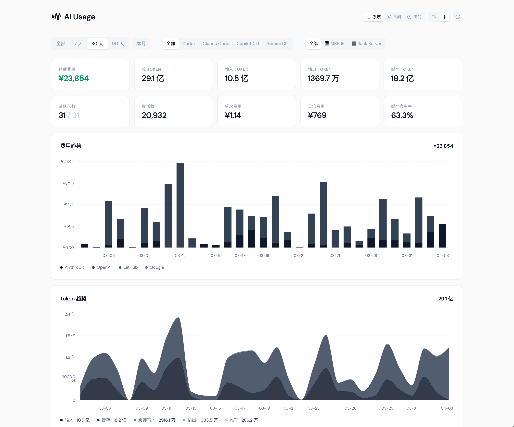

Someone asked me recently: how do you tell if a person is genuinely using AI, or just talking about it?

I thought about it for a moment. The answer isn't "how many tools they subscribe to," or "how many times they open ChatGPT a day." It's: **how many tokens they consume.**

## Token Stats

I asked Claude Code to calculate how many tokens I'd consumed on this MacBook over the past six months. It gave me an answer quickly.

But then I realized something — I run AI agents across multiple devices: my main MacBook, the Mac mini at home, and a remote Linux server. Each of them runs different tools: Claude Code, Codex, Gemini CLI, and more.

So, **across all my devices and all my Code Agents, how many tokens have I actually consumed?**

That's the core problem: every tool manages its own logs, stored locally on its own machine. There's no single place to get a cross-device global view. Without seeing the full picture, you can't make any meaningful judgment.

And more important than "how much have I used so far" is this: **permanently recording that data**. Token consumption is the true history of your collaboration depth with AI — it evolves with your working style, reflects your focus during different periods, and tells you whether a tool has genuinely become part of your workflow. That record is worth keeping.

<iframe src="https://aiusage.yizhe.me/embed?widget=stats-row1&items=0,1,2,3&transparent=true" width="100%" height="100" frameborder="0"></iframe>

## Building AIUsage

With that problem in mind, I had Claude Code help me build an AI Token Usage tracking tool.

The core idea is simple: run a local scanner on each device, read the AI tool session logs, extract token data, and sync everything to a unified database via a Cloudflare Worker. All device data ultimately flows into one Dashboard, visualized by time, tool, and model.

The entire system is fully self-hosted. The Worker and database run under your own Cloudflare account (the free tier is more than enough), with no third party holding your data.

I'm a huge Cloudflare fan — it's the first thing I reach for in every new project.



## How to Use It

After finishing the core features, I realized something: when building tools today, the first question shouldn't be "how detailed is the documentation" — it should be **"can an AI understand and execute this directly?"**

The old path — read docs, understand, then act — is getting longer. The better approach is to let your Code Agent do it directly. As long as the project structure, configuration logic, and deployment steps are written in a way AI can read, users don't need to know any of the underlying details.

AIUsage is designed exactly this way. You don't need to read any documentation. Just send this prompt to your Code Agent:

```
Clone https://github.com/ennann/aiusage.git, read skills/aiusage-server/aiusage-server.md,
and help me deploy AIUsage to my Cloudflare account.
After the server is up, follow skills/aiusage-cli/aiusage-cli.md to connect this device.
```

The agent will read the deployment guide inside the project and handle everything — Worker creation, D1 database initialization, CLI device registration. You just wait for it to finish.

(You will need a Cloudflare account ready to go 😊)

## Embed It Anywhere

The Dashboard is for your own reference, but sometimes you want to share the data, or embed it directly in your blog or personal site. AIUsage ships with a Widget system — any page can embed live data via a single `<iframe>`, no extra configuration or login required.

Here's my current token cost trend, embedded right here:

<iframe src="https://aiusage.yizhe.me/embed?widget=cost-trend&locale=en&range=30d&theme=auto&transparent=true" width="100%" height="360" frameborder="0"></iframe>

Tool, model, and device share breakdown:

<iframe src="https://aiusage.yizhe.me/embed?widget=share&locale=en&range=30d&items=0&theme=auto&transparent=true" width="100%" height="480" frameborder="0"></iframe>

And my favorite — the Token Flow diagram. It shows you exactly which models are handling which projects, and how consumption is distributed:

<iframe src="https://aiusage.yizhe.me/embed?widget=flow&locale=en&theme=auto&transparent=true" width="100%" height="420" frameborder="0"></iframe>

This is all real-time data from my own AIUsage instance. You can embed the same widgets into your blog or website with a single line of HTML.

## Wrapping Up

The most meaningful thing about this project isn't how the Dashboard looks — it's that it quietly stores every day's data.

Switched to a new MacBook? No problem. Stopped using a particular tool? Doesn't matter — the history is still there, intact in your own database. That accumulation becomes more interesting over time.

---

If you just want to see your local usage first, two commands are all you need — no server required:

```bash
npm i -g @aiusage/cli
aiusage report
```

For cross-device sync, Dashboard visualization, and Widget embedding, send the prompt above to your Code Agent. It'll be running within ten minutes.

- **GitHub**: [github.com/ennann/aiusage](https://github.com/ennann/aiusage)
- **Live Demo**: [aiusage.yizhe.me](https://aiusage.yizhe.me)

If you find this useful, a star on GitHub would mean a lot.

<script>
window.addEventListener('message', function(e) {
  if (e.data && e.data.source === 'aiusage-embed' && e.data.height) {
    document.querySelectorAll('iframe').forEach(function(f) {
      try {
        var url = new URL(f.src, location.origin);
        if (url.searchParams.get('widget') === e.data.widget) {
          f.style.height = e.data.height + 'px';
        }
      } catch(err) {}
    });
  }
});
</script>
