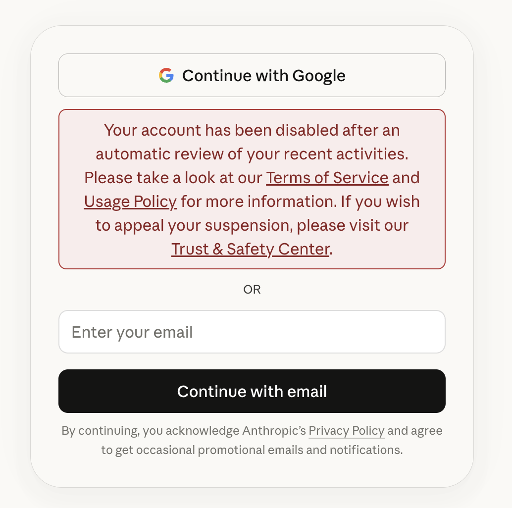
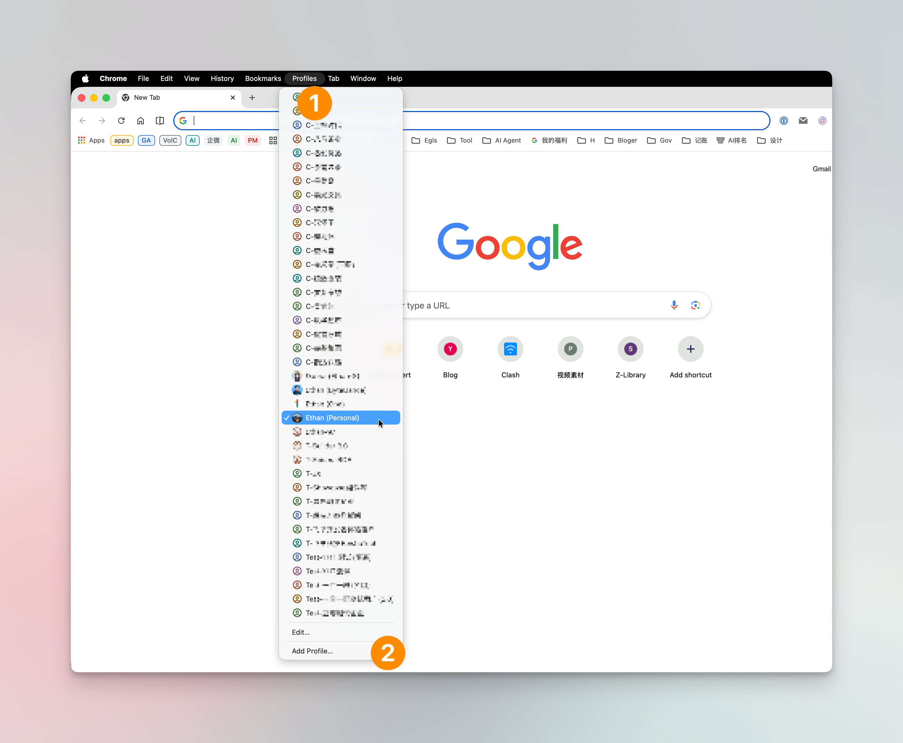
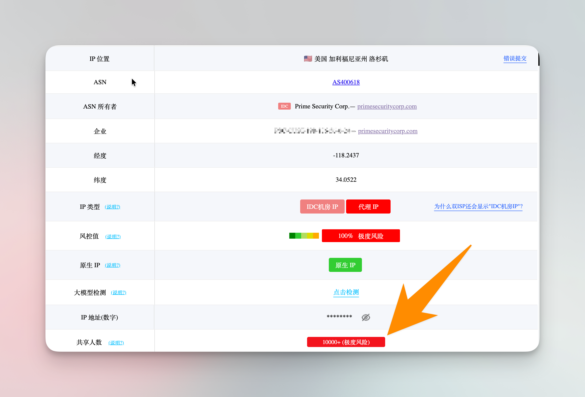
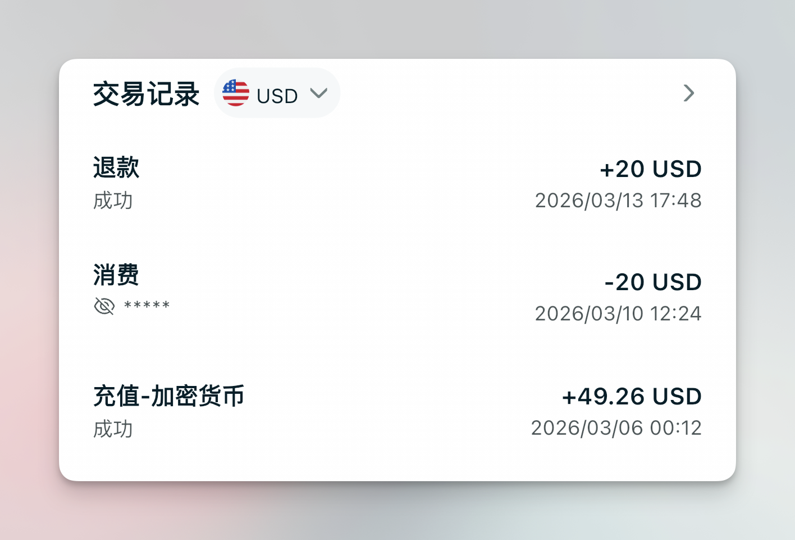
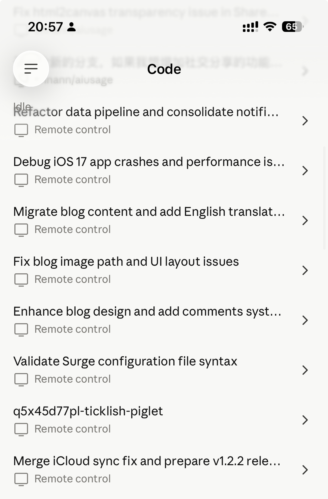

I previously shared a post about subscribing to Claude and ChatGPT memberships — the core idea was using App Store in-app purchase plans to get stable, official subscriptions without needing any credit card or special payment method, just gift cards from the right region.

If you haven't read it yet, here's the detailed guide: [Subscribe to ChatGPT/Claude Without a Foreign Credit Card](https://yizhe.me/en/blog/app-store-ai-subscription)

Today I mainly want to share my day-to-day experience using Claude Pro and Max.

> I actually hesitated for a while about whether to write this at all, since there's already a ton of material on Google and X about Claude account registration and survival tips. So I kept wondering — what's the point of me writing yet another "tutorial"?
>
> But after reading most of those guides, I realized my approach is quite different from what they recommend. So I wouldn't call this a tutorial — it's just me sharing how I actually use Claude.

If you've read other account survival guides, you've probably come across concepts like "residential IP," "**anti-detect browser**," and "crypto card." But I want to point out: I don't use any of these.

## Account Overview

Let me start with some numbers. I've registered a total of 5 Claude accounts. Only one was via email + SMS verification — all the others were registered directly through Google sign-in. As of now, three accounts are still active. I'll explain later why the other two got banned.

One thing I want to emphasize: everything you read online about Claude bans may not be entirely accurate. What works for someone else might not work for you, and vice versa. Claude has never officially disclosed what usage patterns trigger account bans, so everything out there is just speculation based on personal experience.

This article from ByteDance provides a detailed code-level analysis of the ban mechanism — a very valuable deep dive. The findings are drawn directly from Claude Code's "open source" codebase, making them far more reliable than typical user speculation: [Claude Code Ban Mechanism Deep Analysis](https://bytedance.sg.larkoffice.com/docx/QNsIdi8VFoKm00xY8SRlkXxygve)

## Registration Experience

My first Claude account was registered around early 2025. At the time, I had just set up aliases on my Outlook mailbox, so I was signing up for many services through Outlook — including Claude. Back then, email registration still required SMS verification, but I couldn't get a verification code sent to either of my Philippine phone numbers. I kept getting stuck at this step, repeatedly requesting verification codes every few days. After several attempts, the account was simply banned.

The symptom was that on my final attempt, the page displayed a ban notice directly. So my first account was banned before I even finished registering. That's how fast it happened.



When registering my second account, I bought an overseas phone number on Taobao for receiving verification codes — cost me about 10 RMB. After completing verification, I successfully registered with my Google email and started using a Pro subscription on this account.

That account has been running smoothly ever since and is still active today.

Of course, one Pro plan was nowhere near enough for my usage. Sometimes just analyzing a single problem would burn through the 5-hour limit. Completely insufficient.

So I started registering a third and fourth account.

For these later accounts, I skipped the email + SMS approach and went straight through Google sign-in — just clicking **Continue with Google** to register and log in.

I've also noticed that many people get asked for phone verification even when using Google sign-in, probably due to IP or browser issues.

At least for me, with my IP and environment, I was never asked for phone verification when using Google sign-in.

## Login Environment

Here's a Chrome usage tip that I think can fully replace the anti-detect browser concept mentioned above.

The feature is Chrome Profiles. Here's the official guide: [Use Chrome with multiple profiles](https://support.google.com/chrome/answer/2364824?hl=en&co=GENIE.Platform%3DDesktop)

Due to the nature of my work, I frequently need to manage multiple environments with different tenant logins — I can't just keep logging in and out within a single browser. So I started using Chrome profiles early on. Below is my profile list, and this isn't even the peak — at its most, I had so many that they wouldn't fit on a single screen and required scrolling.



So when managing multiple Claude accounts, I simply create a dedicated Chrome profile for each one. Whether logging in via Google or email, each account stays within its own profile — no cross-profile usage.

I think this approach is more than sufficient. It's far more lightweight than downloading a so-called anti-detect browser, and for me, it's been completely stress-free. I haven't encountered any bans caused by this setup.

## IP Addresses

I'm sure you've seen many Claude guides warning you to use a residential IP for better IP quality. But honestly, I don't even have a residential IP.

Besides my proxy service nodes, I have a DMIT US server. While I've set up services on it, I rarely use it. Most of the time, I connect to Claude and OpenAI services directly through my proxy service's IP. Only occasionally do I use my own server.



The proxy service I use — the IP quality is pretty terrible, to be honest. But the vast majority of my usage goes through these IPs. As of now, none of my 4 paid accounts have been banned due to network or IP issues.

So I believe the claims about bans caused by IP quality are mostly unsubstantiated. As supporting evidence, the ByteDance analysis article I mentioned earlier doesn't reference any IP-related evidence in its Chapter 6 either.

## Payment Method

As mentioned in the opening article, all my Claude subscriptions — whether Pro or Max — are purchased through App Store in-app purchases, all from the Nigerian region. No US App Store, no credit card.

However, I did get one account banned because of a payment method change. That account had been running normally for a year — a real shame.

Here's what happened: the account had been consistently paying through Nigerian in-app purchases. But during that period, everyone was hyped about Bitget crypto cards, so I got one too. There was a promotion offering $10 cashback for paying AI memberships with the crypto card. I figured I'd use it to verify that the card works. The $10 cashback wasn't even attractive price-wise — my regular subscription price was already very cheap. It was purely a test.

The interesting part: after the subscription expired, I paid directly on the web using the crypto card. Payment went through, and I happily started using Claude Code CLI.



The result: paid at noon, banned by 2 PM. The CLI showed a "suspended" message.

I assumed I'd lose the money, but three days later the $20 was refunded to my card.

Anthropic's ban speed — nothing to complain about. Their refund process — also nothing to complain about.

And just like that, my longest-running Claude account was gone.

In the following days, I actually saw people on X who successfully subscribed using the same crypto card. So perhaps the drastic change between two very different payment methods was the actual trigger. From then on, I stopped changing payment methods and stuck with Nigerian in-app purchases.

What I find most remarkable is that using the same App Store account to pay for different Claude accounts caused no issues at all. At peak, I had one App Store account paying for three Pro subscriptions simultaneously — no bans.

Currently, I've upgraded one Pro account to Max, and the other two will expire within this month. But those two Pro accounts are barely used anymore.

## Usage Patterns

For my daily usage, the vast majority of my time is spent in Claude Code CLI. I was surprised to find that many people didn't know Pro plans also work in the CLI — it's been available for quite a while.

During the multi-Pro-account phase, whenever one account hit its limit, I'd switch via /login. There are other multi-account management tools out there, like CC Switch, but I personally just stick with /login.

As for mobile usage, I'm sure you've seen people online saying you shouldn't log into your Claude account on your phone.

My take: you've already paid for such a powerful AI tool — are you really going to limit yourself to using it on just one device? That would be a waste.

So in my daily workflow, regardless of how many accounts I have, I log into my MacBook Pro first, then also log in on my phone. In some cases, I also log in on a server.

On mobile, the feature I use most is Remote Control.

Sometimes when I haven't finished work on my laptop, I can just enable Remote Control and continue working remotely from my phone. In some cases, I find Claude's research reports even better than Gemini's tools. All of this gets done on my phone.

My default startup command has even evolved to this — bypassing permissions and enabling remote control by default:

```
claude --dangerously-skip-permissions --remote-control
```



Of course, before subscribing to Max, having multiple Pro accounts did have some inconveniences.

Each time I switched to a different account, say Account A, the remote tools I'd started in the CLI would require my phone's Claude App to also switch to Account A for remote control to work. Perfectly logical, but still a bit annoying. Since upgrading to Max, I no longer need to switch accounts at all.

## Network Rules

I might frequently switch Claude accounts across two computers and a phone. But there's a key prerequisite: all my devices use Surge as the network proxy tool, and its configuration file syncs automatically via iCloud.

This means if I modify a rule on one device, all other devices pick up the change simultaneously.

So even though I use multiple devices, their network proxy configurations are essentially identical. Whether using proxy service IPs or my VPS, at least for any given account, the device and IP remain relatively stable — even though that IP might have thousands of other people using it at the same time.

I might also frequently switch Claude accounts on these devices — as I mentioned earlier, during my multi-Pro phase my quota was never enough, so frequent switching was necessary.

Here's my Surge network rule set, which includes rules for common AI tools. For me, the most critical rules are for Claude. You can have any AI agent translate these rules into the format your own proxy software requires: [Surge AI Rule List](https://github.com/ennann/SurgeToolkit/blob/main/Rules/ai.list)

## Conclusion

As you can see from my experience, my approach differs significantly from what most online guides recommend.

No residential IP, no anti-detect browser, no US credit card — I use proxy service nodes, Chrome profiles, and Nigerian App Store in-app purchases. Of the two banned accounts, one was banned during registration due to repeated verification code requests, and the other was banned for abruptly changing payment methods. The remaining three accounts are all still running normally.

So rather than spending effort on elaborate environment disguises, I think the focus should be on two things: **stay consistent** and **avoid sudden changes**. A stable login environment, a stable payment method, a stable network exit — these are what truly keep an account alive.

Of course, as I said at the beginning, all ban-related experience is just personal speculation — including this post. Anthropic has never disclosed specific ban criteria. All I can do is share my actual usage patterns for your reference.

If you have any questions or want to discuss, feel free to leave a comment below.
