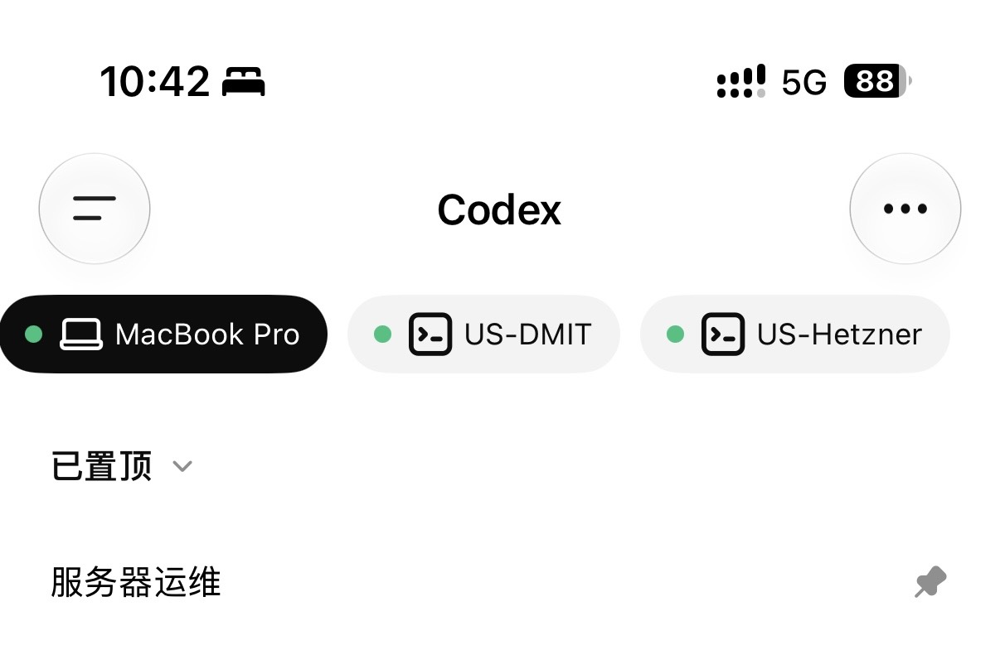

最近把两台美国服务器都接入了 Codex 远程控制，感觉这个事情对我来说还挺有意义的。

以前我维护服务器，基本上只有一种方式：打开 MacBook Pro，然后从本机 SSH 到某一台服务器上，查日志、改配置、重启服务。这个方式当然没问题，但它有一个前提，就是电脑必须在身边。

后来我开始换了一个思路：能不能让一台服务器本身变成运维入口？

这篇不算完整教程，更像是把我自己的这套运维方式记录下来。很多细节每个人的服务器、账号、网络环境都不一样，直接照抄没有意义。但方向是通用的：让一台可信服务器常驻 Codex，再让它去连接其他服务器。

<style>
  .ops-flow {
    --flow-border: color-mix(in oklab, var(--border-subtle) 82%, transparent);
    --flow-panel: color-mix(in oklab, var(--panel-subtle) 76%, transparent);
    --flow-panel-strong: color-mix(in oklab, var(--accent) 9%, var(--panel-subtle));
    --flow-muted: var(--text-secondary);
    margin: 1.6rem 0 2rem;
    border: 1px solid var(--flow-border);
    border-radius: 18px;
    background:
      radial-gradient(circle at top left, color-mix(in oklab, var(--accent) 14%, transparent), transparent 30%),
      var(--flow-panel);
    padding: 1.15rem;
    box-shadow: 0 18px 50px rgba(15, 23, 42, 0.06);
  }

  .ops-flow__title {
    margin: 0 0 1rem;
    color: var(--text-primary);
    font-size: 0.9rem;
    font-weight: 700;
    letter-spacing: 0;
  }

  .ops-flow__grid {
    display: grid;
    grid-template-columns: minmax(0, 1fr) auto minmax(0, 1fr);
    align-items: stretch;
    gap: 0.8rem;
  }

  .ops-flow__grid--three {
    grid-template-columns: minmax(0, 1fr) auto minmax(0, 1fr) auto minmax(0, 1fr);
  }

  .ops-flow__grid--two {
    grid-template-columns: minmax(0, 1fr) minmax(0, 1fr);
  }

  .ops-flow__node {
    min-width: 0;
    border: 1px solid var(--flow-border);
    border-radius: 14px;
    background: color-mix(in oklab, var(--background) 78%, transparent);
    padding: 0.9rem;
  }

  .ops-flow__node--strong {
    background: var(--flow-panel-strong);
    border-color: color-mix(in oklab, var(--accent) 34%, var(--flow-border));
  }

  .ops-flow__kicker {
    display: block;
    margin-bottom: 0.28rem;
    color: var(--flow-muted);
    font-size: 0.72rem;
  }

  .ops-flow__name {
    color: var(--text-primary);
    font-size: 1rem;
    font-weight: 800;
    line-height: 1.25;
  }

  .ops-flow__desc {
    margin-top: 0.38rem;
    color: var(--flow-muted);
    font-size: 0.76rem;
    line-height: 1.55;
  }

  .ops-flow__arrow {
    align-self: center;
    color: var(--accent);
    font-weight: 800;
    line-height: 1;
    opacity: 0.9;
  }

  .ops-flow__stack {
    display: grid;
    gap: 0.55rem;
  }

  .ops-flow__pill-row {
    display: flex;
    flex-wrap: wrap;
    gap: 0.45rem;
    margin-top: 0.65rem;
  }

  .ops-flow__pill {
    border: 1px solid color-mix(in oklab, var(--accent) 26%, var(--flow-border));
    border-radius: 999px;
    color: var(--text-primary);
    background: color-mix(in oklab, var(--accent) 8%, transparent);
    padding: 0.2rem 0.55rem;
    font-size: 0.72rem;
    line-height: 1.3;
  }

  .ops-flow__steps {
    display: grid;
    grid-template-columns: repeat(5, minmax(0, 1fr));
    gap: 0.65rem;
  }

  .ops-flow__step {
    position: relative;
    border: 1px solid var(--flow-border);
    border-radius: 14px;
    background: color-mix(in oklab, var(--background) 78%, transparent);
    padding: 0.9rem 0.8rem;
  }

  .ops-flow__step::after {
    content: "→";
    position: absolute;
    top: 50%;
    right: -0.55rem;
    transform: translate(50%, -50%);
    color: var(--accent);
    font-weight: 800;
  }

  .ops-flow__step:last-child::after {
    content: "";
  }

  .ops-flow__step-index {
    display: inline-flex;
    align-items: center;
    justify-content: center;
    width: 1.45rem;
    height: 1.45rem;
    margin-bottom: 0.55rem;
    border-radius: 999px;
    background: var(--accent);
    color: var(--background);
    font-size: 0.72rem;
    font-weight: 800;
  }

  .ops-flow__step-title {
    color: var(--text-primary);
    font-size: 0.84rem;
    font-weight: 800;
    line-height: 1.35;
  }

  .ops-flow__step-desc {
    margin-top: 0.3rem;
    color: var(--flow-muted);
    font-size: 0.72rem;
    line-height: 1.45;
  }

  .ops-flow__matrix {
    display: grid;
    grid-template-columns: minmax(0, 1fr) minmax(0, 1fr);
    gap: 0.85rem;
  }

  .ops-flow__watchdog {
    display: grid;
    grid-template-columns: minmax(0, 1fr) auto minmax(0, 1fr);
    gap: 0.8rem;
    align-items: center;
  }

  .ops-flow__rail {
    display: flex;
    align-items: center;
    justify-content: center;
    min-height: 3rem;
    color: var(--accent);
    font-size: 1.2rem;
    font-weight: 800;
  }

  .ops-flow__caption {
    margin: 0.9rem 0 0;
    color: var(--flow-muted);
    font-size: 0.75rem;
    line-height: 1.55;
  }

  @media (max-width: 720px) {
    .ops-flow {
      padding: 1rem;
      border-radius: 16px;
    }

    .ops-flow__grid,
    .ops-flow__grid--three,
    .ops-flow__grid--two,
    .ops-flow__watchdog,
    .ops-flow__matrix,
    .ops-flow__steps {
      grid-template-columns: 1fr;
    }

    .ops-flow__arrow,
    .ops-flow__rail {
      min-height: auto;
      transform: rotate(90deg);
    }

    .ops-flow__step::after {
      top: auto;
      right: 50%;
      bottom: -0.7rem;
      transform: translate(50%, 50%) rotate(90deg);
    }
  }
</style>

## 原来的维护方式

最开始的结构很简单，就是我的 MacBook Pro 连接所有机器。

<div class="ops-flow">
  <p class="ops-flow__title">早期模式：本机直连所有服务器</p>
  <div class="ops-flow__grid">
    <div class="ops-flow__node ops-flow__node--strong">
      <span class="ops-flow__kicker">唯一入口</span>
      <div class="ops-flow__name">MacBook Pro</div>
      <div class="ops-flow__desc">登录、SSH、查日志、改配置都从本机发起。</div>
    </div>
    <div class="ops-flow__arrow">SSH →</div>
    <div class="ops-flow__node">
      <span class="ops-flow__kicker">服务器集群</span>
      <div class="ops-flow__name">HK / US / JP / UK / CN</div>
      <div class="ops-flow__pill-row">
        <span class="ops-flow__pill">面板</span>
        <span class="ops-flow__pill">网站</span>
        <span class="ops-flow__pill">Agent</span>
        <span class="ops-flow__pill">代理服务</span>
      </div>
    </div>
  </div>
  <p class="ops-flow__caption">这个结构简单，但维护入口强依赖 MacBook Pro。电脑不在身边，很多动作就断了。</p>
</div>

这种方式在电脑前很好用。问题是，只要我人不在电脑前，或者电脑没有开着，维护动作就很难继续。

当然，我也可以用手机 SSH 客户端连服务器，但体验实在不算好。查状态还可以，真要让 AI 帮我分析日志、改配置、对比文档，就很不舒服。AI Agent 最适合的场景，还是它自己能读文件、能跑命令、能保存上下文。

所以后来我先做了第一步：把其中一台美国服务器变成运维入口。

<div class="ops-flow">
  <p class="ops-flow__title">第一阶段：让一台服务器变成常驻运维入口</p>
  <div class="ops-flow__grid ops-flow__grid--three">
    <div class="ops-flow__node">
      <span class="ops-flow__kicker">随身入口</span>
      <div class="ops-flow__name">手机 Codex</div>
      <div class="ops-flow__desc">负责进入远程会话，不直接维护所有机器。</div>
    </div>
    <div class="ops-flow__arrow">Remote →</div>
    <div class="ops-flow__node ops-flow__node--strong">
      <span class="ops-flow__kicker">常驻环境</span>
      <div class="ops-flow__name">美国服务器 A</div>
      <div class="ops-flow__desc">存放 SSH key、服务器说明文件和固定运维目录。</div>
    </div>
    <div class="ops-flow__arrow">SSH →</div>
    <div class="ops-flow__node">
      <span class="ops-flow__kicker">被维护对象</span>
      <div class="ops-flow__name">其他服务器</div>
      <div class="ops-flow__desc">通过美国服务器 A 继续连接、排查和操作。</div>
    </div>
  </div>
</div>

这样以后，我在手机上打开 Codex，就可以进入美国服务器 A。美国服务器 A 上已经准备好了 SSH key、服务器说明文件和一些固定的运维目录，它可以继续连到其他服务器。

这个变化对我来说很大。维护动作从“我必须打开 MacBook Pro”，变成了“我只要能打开手机”。

## 为什么后来又加了第二台美国服务器

只有一台入口服务器也有问题。万一这台机器上的 Codex 远程进程挂了，我人在外面，手机就连不回去了。

所以我又把第二台美国服务器也接入了 Codex。现在结构变成这样：

<div class="ops-flow">
  <p class="ops-flow__title">第二阶段：双入口 + 互相兜底</p>
  <div class="ops-flow__grid ops-flow__grid--three">
    <div class="ops-flow__node">
      <span class="ops-flow__kicker">随身入口</span>
      <div class="ops-flow__name">手机 Codex</div>
      <div class="ops-flow__desc">远程列表里同时保留两台美国服务器。</div>
    </div>
    <div class="ops-flow__arrow">进入 →</div>
    <div class="ops-flow__stack">
      <div class="ops-flow__node ops-flow__node--strong">
        <span class="ops-flow__kicker">入口 A</span>
        <div class="ops-flow__name">US-DMIT</div>
        <div class="ops-flow__desc">日常运维入口之一，也负责检查入口 B。</div>
      </div>
      <div class="ops-flow__node ops-flow__node--strong">
        <span class="ops-flow__kicker">入口 B</span>
        <div class="ops-flow__name">US-Hetzner</div>
        <div class="ops-flow__desc">核心网站服务器，操作边界写得更严格。</div>
      </div>
    </div>
    <div class="ops-flow__arrow">SSH →</div>
    <div class="ops-flow__node">
      <span class="ops-flow__kicker">被维护对象</span>
      <div class="ops-flow__name">全量服务器</div>
      <div class="ops-flow__desc">HK、JP、UK、CN 以及其他美国节点。</div>
    </div>
  </div>
  <div class="ops-flow__watchdog" style="margin-top: 0.85rem;">
    <div class="ops-flow__node">
      <span class="ops-flow__kicker">Watchdog</span>
      <div class="ops-flow__name">A 检查 B</div>
    </div>
    <div class="ops-flow__rail">↔</div>
    <div class="ops-flow__node">
      <span class="ops-flow__kicker">Watchdog</span>
      <div class="ops-flow__name">B 检查 A</div>
    </div>
  </div>
</div>

两台美国服务器都在我的手机远程列表里。平时随便进哪一台都可以做维护；如果其中一台上的 Codex 进程挂了，另一台还有机会把它拉起来。



现在手机里能同时看到 MacBook Pro、US-DMIT 和 US-Hetzner。对我来说，这已经不是“远程连一台服务器”，而是随时可以切到不同运维入口。

这里最重要的不是“多一台服务器”，而是把入口做成双点。服务器运维最怕的不是某个服务坏了，而是你连修它的入口都没了。

## MacBook Pro 作为认证源

这里有一个很关键的细节：我会切换 Codex 账号。

如果每台服务器都手动登录一遍，后面切账号会非常麻烦。更合理的方式是把 MacBook Pro 当成认证源。我的日常登录、账号切换都先在 MacBook Pro 上完成，然后再把需要的认证文件同步到服务器。

Codex 的登录态会保存在本机配置目录里，比如 `~/.codex/auth.json`。这类文件本质上就是账号凭证，不能把它当普通配置看。

我的同步流程大概是这样：

<div class="ops-flow">
  <p class="ops-flow__title">认证同步：本机切账号，服务器继承登录态</p>
  <div class="ops-flow__steps">
    <div class="ops-flow__step">
      <span class="ops-flow__step-index">1</span>
      <div class="ops-flow__step-title">本机切账号</div>
      <div class="ops-flow__step-desc">先在 MacBook Pro 完成 Codex 登录。</div>
    </div>
    <div class="ops-flow__step">
      <span class="ops-flow__step-index">2</span>
      <div class="ops-flow__step-title">确认可用</div>
      <div class="ops-flow__step-desc">确保本机已经拿到正确登录态。</div>
    </div>
    <div class="ops-flow__step">
      <span class="ops-flow__step-index">3</span>
      <div class="ops-flow__step-title">同步凭证</div>
      <div class="ops-flow__step-desc">只同步 auth.json 和必要配置。</div>
    </div>
    <div class="ops-flow__step">
      <span class="ops-flow__step-index">4</span>
      <div class="ops-flow__step-title">重启远程进程</div>
      <div class="ops-flow__step-desc">让服务器加载新的认证文件。</div>
    </div>
    <div class="ops-flow__step">
      <span class="ops-flow__step-index">5</span>
      <div class="ops-flow__step-title">手机确认</div>
      <div class="ops-flow__step-desc">检查远程入口是否重新出现。</div>
    </div>
  </div>
</div>

这里我不会复制整个 `~/.codex` 目录。里面有很多日志、历史记录、数据库、缓存文件，没必要同步到服务器。通常需要同步的是认证文件，以及少量确实需要保持一致的配置，比如 `config.toml`。

可以把认证同步理解成一个独立动作：本机切账号，服务器继承这个登录态。这样以后我换 Codex 账号时，只需要在本机处理一次，再把认证 JSON 发到两台入口服务器上。

当然，这一步风险也最高。`auth.json` 不要进 Git，不要放公开目录，不要写进文档，不要让自动备份把它同步到不该去的地方。服务器上也要限制文件权限，只给运行 Codex 的用户读。

## 安装版本这件事

Codex 更新很快，安装来源最好收敛一下。

截至 2026-06，我看到 [Codex CLI 官方文档](https://developers.openai.com/codex/cli)里，macOS 和 Linux 推荐的安装方式是 standalone installer：

```bash
curl -fsSL https://chatgpt.com/codex/install.sh | sh
```

如果要自动化安装，也可以按官方文档使用非交互模式。升级 standalone 版本时，重新跑安装脚本即可。

这里我不建议在服务器上随手装一个搜索出来的 npm 包。Codex CLI 确实有官方 npm 包 `@openai/codex`，但如果只是凭包名搜索，很容易装错来源或者装到不符合预期的版本。对于服务器这种要长期跑远程入口的环境，我更倾向于按官网当前推荐方式安装，后面做自动升级也更简单。

## 给 AI 看的服务器说明文件

把 Codex 放到服务器上之后，还有一件事很重要：要给它一份服务器说明文件。

这个文件不是写给人看的 README，而是写给 AI Agent 看的运维上下文。里面至少要写几类信息：

- 当前这台服务器是谁，承担什么角色。
- 其他服务器的 IP、用途和 SSH 方式。
- SSH key 放在哪里，文件权限应该是什么。
- 哪些服务可以查状态，哪些服务不能随便重启。
- 哪些服务器是核心业务机器，操作前必须非常谨慎。

我自己遇到过一个命名上的问题：在翻墙场景里，“美国一服务器”可能指 DMIT；但在日常运维场景里，“美国一服务器”又可能指配置最强、跑核心网站的 Hetzner。人自己知道上下文，AI 不一定知道。

所以说明文件里最好少写口头简称，多写 IP、域名、用途和边界。比如某台服务器跑主站服务，就应该明确写：除非用户明确要求，否则不要重启网站相关服务。

这类说明文件越清楚，AI 做运维越稳。

## 权限模式

我自己的使用习惯，是在可信服务器上把 Codex 权限设置成“替我批准”。这样手机上做维护时，不需要每一个命令都点确认。

这个模式很方便，但它只适合自己的可信服务器。因为一旦把权限放开，Codex 就真的可以执行很多操作。它可以查日志，也可以删文件；可以重启服务，也可以改配置。

所以前提是：服务器是自己的，SSH key 是自己的，认证文件只在可信机器之间同步，说明文件也写清楚哪些事情不能乱动。

如果是团队机器、客户机器、生产数据库机器，我不会默认这么开。

## Watchdog 怎么设计

最后是 Watchdog。

一开始我想过让每台服务器自己检查自己的 Codex 进程，挂了就拉起来。但这个方案有一个问题：如果它自己升级失败，或者进程管理脚本出问题，它可能连“检查自己”这件事也做不了。

所以我更喜欢两台服务器互相检查。

<div class="ops-flow">
  <p class="ops-flow__title">Watchdog：互相检查，不只检查自己</p>
  <div class="ops-flow__watchdog">
    <div class="ops-flow__node ops-flow__node--strong">
      <span class="ops-flow__kicker">US-DMIT</span>
      <div class="ops-flow__name">检查 US-Hetzner</div>
      <div class="ops-flow__desc">版本、进程、远程入口、升级后恢复情况。</div>
    </div>
    <div class="ops-flow__rail">↔</div>
    <div class="ops-flow__node ops-flow__node--strong">
      <span class="ops-flow__kicker">US-Hetzner</span>
      <div class="ops-flow__name">检查 US-DMIT</div>
      <div class="ops-flow__desc">同样负责升级、重启和失败日志留存。</div>
    </div>
  </div>
  <div class="ops-flow__matrix" style="margin-top: 0.85rem;">
    <div class="ops-flow__node">
      <span class="ops-flow__kicker">检查项</span>
      <div class="ops-flow__name">进程 / 版本 / 入口</div>
      <div class="ops-flow__desc">不只看进程在不在，也要确认手机端还能进。</div>
    </div>
    <div class="ops-flow__node">
      <span class="ops-flow__kicker">失败处理</span>
      <div class="ops-flow__name">留日志，等人工接手</div>
      <div class="ops-flow__desc">自动化只做低风险恢复，不盲目扩大动作。</div>
    </div>
  </div>
</div>

Watchdog 做的事情不需要复杂：

- 检查对方机器上的 Codex 远程进程是否存在。
- 检查 Codex 版本是否需要升级。
- 如果升级了，重启远程进程。
- 升级后确认远程入口恢复。
- 失败时留下日志，方便人工接手。

我觉得这里最关键的是升级流程。Codex 这种工具更新很快，如果每天检查一次版本，有更新就自动升级，看起来很自然。但如果让一台机器只负责自己升级，就有可能升级完远程进程没起来，手机直接失联。

两台服务器互相兜底之后，这个风险小很多。A 升级 B，B 升级 A。哪怕其中一台失败，另一台还在。

## 这套方案适合什么场景

对我来说，这套方案最适合日常轻量运维。

比如查一台服务器为什么内存高，看看某个 Docker 容器在不在，确认 Nginx 配置，重启一个非核心服务，查看定时任务日志，或者让 AI 根据项目文档判断某个服务应该怎么迁移。

这类事情以前都要坐到电脑前。现在很多时候，在手机上就能处理掉。

但它不适合所有场景。数据库迁移、删除数据、核心服务重启、证书和 DNS 大改，这些动作我仍然会让 AI 先分析、先给计划，再明确确认后执行。

远程控制不是为了让服务器变成无人驾驶，而是让入口一直都在。

## 我现在的结构

最后整理一下目前的结构：

<div class="ops-flow">
  <p class="ops-flow__title">最终结构：认证源、双入口、被维护服务器分层</p>
  <div class="ops-flow__grid ops-flow__grid--three">
    <div class="ops-flow__node">
      <span class="ops-flow__kicker">认证源</span>
      <div class="ops-flow__name">MacBook Pro</div>
      <div class="ops-flow__desc">负责登录 Codex、切账号、同步认证文件。</div>
    </div>
    <div class="ops-flow__arrow">同步 →</div>
    <div class="ops-flow__stack">
      <div class="ops-flow__node ops-flow__node--strong">
        <span class="ops-flow__kicker">入口 A</span>
        <div class="ops-flow__name">US-DMIT</div>
      </div>
      <div class="ops-flow__node ops-flow__node--strong">
        <span class="ops-flow__kicker">入口 B</span>
        <div class="ops-flow__name">US-Hetzner</div>
      </div>
    </div>
    <div class="ops-flow__arrow">SSH →</div>
    <div class="ops-flow__node">
      <span class="ops-flow__kicker">被维护对象</span>
      <div class="ops-flow__name">其他服务器</div>
      <div class="ops-flow__desc">通过两台入口服务器完成日常维护。</div>
    </div>
  </div>
  <div class="ops-flow__grid ops-flow__grid--three" style="margin-top: 0.85rem;">
    <div class="ops-flow__node">
      <span class="ops-flow__kicker">随身访问</span>
      <div class="ops-flow__name">手机 Codex</div>
    </div>
    <div class="ops-flow__arrow">Remote →</div>
    <div class="ops-flow__node ops-flow__node--strong">
      <span class="ops-flow__kicker">可选入口</span>
      <div class="ops-flow__name">US-DMIT / US-Hetzner</div>
    </div>
    <div class="ops-flow__arrow">Watchdog</div>
    <div class="ops-flow__node">
      <span class="ops-flow__kicker">可靠性</span>
      <div class="ops-flow__name">互相检查，互相拉起</div>
    </div>
  </div>
</div>

MacBook Pro 是认证源，两台美国服务器是常驻入口，其他服务器通过它们维护。两台美国服务器之间互相检查，保证至少有一个入口能用。

这件事做完之后，我最大的感受是：服务器维护这件事，不再强绑定某一台本地电脑了。

以前我需要先回到 MacBook Pro 前面，再去连接服务器。现在我只要打开手机，就能进入一个已经准备好密钥、文档和上下文的运维环境。对我这种经常在不同地方切换设备的人来说，这个变化挺明显的。

如果你也有几台自己的服务器，并且已经开始用 Codex 或类似的 AI Agent 做运维，我觉得可以试试这个方向。先从一台非核心服务器开始，不要一上来就把最高权限交出去。等认证同步、说明文件、Watchdog 都跑顺之后，再慢慢扩大范围。
